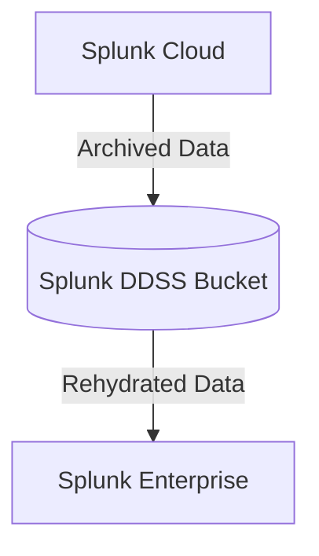

# DDSS Rehydration Toolkit

This toolkit is intended to help customers of [Splunk Cloud](https://www.splunk.com/en_us/products/splunk-cloud-platform.html) utilizing [Dynamic Data Self-Storage (DDSS)](https://docs.splunk.com/Documentation/SplunkCloud/latest/Service/SplunkCloudservice#Dynamic_Data_Self-Storage_.28DDSS.29) for archived data.  The goal of this toolkit is to simplify the process of
1. Creating a Splunk Enterprise server to host and search rehydrated DDSS 
2. Copying and rehydrating DDSS data to the Splunk Enterprise Server

There are two sets of instructions:
1. Deployment Instructions: This includes deploying the AWS CloudFormation template to an AWS account that will create the Splunk Enterprise server to rehydrate and search the DDSS data.
2. Rehydration Instructions: This includes the instructions needed to copy the DDSS data from S3, rehydrate that data, and make that data searchable.


## Architecture Overview
As ingested data ages out of Splunk Cloud, it can optionally be sent to a private archive, owned, maintained, and paid for by the customer.  Splunk refers to this as Dynamic Data Self-Storage (DDSS).  Documentation on details around what DDSS is, requirements for this storage, and how to configure it can be found in the [Splunk Cloud Platform Admin Manual](https://docs.splunk.com/Documentation/SplunkCloud/latest/Admin/DataSelfStorage).  The data sent to the DDSS location can be retrieved, rehydrated, and made searchable again inside of a customer-managed Splunk Enterprise server following [documented instructions](https://docs.splunk.com/Documentation/SplunkCloud/latest/Admin/DataSelfStorage#Restore_indexed_data_from_a_self_storage_location).

This toolkit makes this process a little easier by providing an AWS CloudFormation template for creating the Splunk Enterprise server, documentation on how to set up the Splunk Enterprise server, and additional documentation on how to restore the data.




## Deployment Instructions
The first set of steps to using the toolkit is to deploy the CloudFormation template that defines the relevant AWS resources to launch a Splunk Enterprise server.

1. Decide on which AWS region the Toolkit should be deployed to.  Ideally, this would be the same region where your Splunk Cloud stack is deployed to since that will be where the DDSS S3 bucket is as well.
2. Search for "Splunk Enterprise" in the AWS Marketplace, and subscribe to it.  We won't be launching our server through the Marketplace, however we will be using AMI that is provided by the subscription.
3. On your AWS Marketplace subscription for Splunk Enterprise, click "Launch new instance", select the region you decided on in step 1, then copy the "AMI ID" that is referenced on the page.
4. Identify and/or create an [AWS IAM Policy](https://docs.aws.amazon.com/IAM/latest/UserGuide/access_policies.html) which has appropriate access to the data and any encryption keys that will be rehydrated.  
  - This policy will need access to the S3 bucket the data is located in, and any KMS keys that are used to encrypt that data.
  - An example of this policy can be found in `splunkDataAccessRole-Example.yml`.
5. (Optional) [Restore the DDSS data from AWS Glacier](https://docs.aws.amazon.com/AmazonS3/latest/userguide/restoring-objects.html).
  - The [Splunk DDSS Exploration Toolkit](https://github.com/pdreeves/splunk-ddss-exploration-toolkit) can be used to help identify which files need to be restored.
6. [Determine the size of the data in S3](https://aws.amazon.com/blogs/storage/find-out-the-size-of-your-amazon-s3-buckets/) that will be copied to Splunk and rehydrated.
7. Deploy the `splunkInstanceCloudformation.yml` CloudFormation template in the region you decided on in step 1, with the following parameters changed from the defaults (other parameters can be changed as-needed):
  - `amiID`: The AMI ID from step 2
  - `dataAccessPolicyArn`: The IAM Policy ARN from step 4.
  - `ebsVolumeSize`: The size of the EBS volume attached to Splunk.  This should be 3.5x the size from step 6.  For example, if you've determined that there is 100GB of data in S3 which needs to be rehydrated, set this to 350GB.
  - `subnetID`: The ID of an existing public subnet that the Splunk Enterprise instance will be deployed to.
  - `vpcID` The ID of an existing VPC that the Splunk Enterprise instance will be deployed to.
8. Retrieve the instance ID, and public IP of the instance that was deployed.
  - The instance IP is set as the `instancePublicIP` output on the CloudFormation template, or can be retrieved through other means such as the AWS console.
  - The instance ID is set as the `instanceID` output on the CloudFormation template, or can be retrieved through other means such as the AWS console.
9. Log into the Splunk Enterprise server at `http://{{ instancePublicIP }}:8000`, using the username of `admin` and password of `SPLUNK-{{ instanceID }}`, then [change the password](https://docs.splunk.com/Documentation/Splunk/latest/Security/Changeapassword) of the admin account.
  - `instancePublicIP` is public IP of the instance
  - `instanceID` is the ID of the instance, including `i-`
  - For example, if your Splunk Enterprise server was launched with an IP address of `34.215.99.108` with an instance ID of `i-0b48683bd9f23b535`, you would log into `http://34.215.99.108:8000` with a username of `admin` and password of `SPLUNK-i-0b48683bd9f23b535`.
10. (Optional) [Install any add-ons or apps](https://docs.splunk.com/Documentation/AddOns/released/Overview/Singleserverinstall) that will be required to parse or analyze the data that will be rehydrated.
11. (Optional) [Add any additional user accounts](https://docs.splunk.com/Documentation/Splunk/latest/Security/Addandeditusers) for users that will need access to the rehydrated data, [configure LDAP authentication](https://docs.splunk.com/Documentation/Splunk/latest/Security/SetupuserauthenticationwithLDAP) and/or [configure SAML authentication](https://docs.splunk.com/Documentation/Splunk/latest/Security/HowSAMLSSOworks).


## Rehydration Instructions
The second set of steps to using the toolkit is to perform a data copy, rehydrate the data, and make the data searchable in the Splunk Enterprise instance that was created in the Deployment Instructions.

1. Using [AWS Systems Manager Session Manager](https://docs.aws.amazon.com/systems-manager/latest/userguide/session-manager-working-with-sessions-start.html), connect to the Splunk Enterprise instance that was deployed in the Deployment Instructions, and assume the root user account
2. Assume the root user account
  - `$ sudo su`
3. Make a directory to hold the frozen data.
  - Example: `# mkdir /opt/splunk/ddss-rehydrate/`
4. Copy the files down from S3 that need to be rehydrated to the directory created in step 3.
  - Example: `# aws s3 sync s3://contoso-94q7su9iuudm-ddss-bucket/ /opt/splunk/ddss-rehydrate/`
5. Grant the Splunk user permission to the files to be rehydrated.
  - Example: `chown -R splunk:splunk /opt/splunk/ddss-rehydrate/`
6. Rehydrate the files.
  - Example to do 1 Splunk bucket at a time: `/opt/splunk/bin/splunk rebuild /opt/splunk/ddss-rehydrate/db_1659509451_1588705889_5_3B91BCF7-ADB6-41A9-8C69-D21202AA5943`
  - Example to rehydrate all of the buckets in the directory: `for d in /opt/splunk/ddss-rehydrate/* ; do (/opt/splunk/bin/splunk rebuild "$d"); done`
7.  Modify `indexes.conf`, adding a new index that points the new index's thawedDB directory to the rehydrated data.
  - Make sure to set retention settings such as `frozenTimePeriodInSecs` and `maxTotalDataSizeMB` to a high value so Splunk doesn't re-freeze the data.
  - It's easiest to edit the `/opt/splunk/etc/system/local/indexes.conf` file.
  - Example:
      ```
      [ddss-rehydrate]
      homePath = /opt/splunk/var/lib/splunk/$_index_name/db
      coldPath = /opt/splunk/var/lib/splunk/$_index_name/colddb
      thawedPath = /opt/splunk/ddss-rehydrate/
      frozenTimePeriodInSecs = 4294967295
      maxTotalDataSizeMB = 4294967295
      ```
8. Restart or reload Splunkd
9. Log back into the Splunk interface, and search the data.  Depending on how old the data is, you may need to change your searches to use the "All Time" setting before you're able to see data.


## Teardown Instructions
Once the rehydrated data has been searched and no longer needs to be searches, the teardown process is simple and straightforward.

1. Delete the CloudFormation template that was launched in step 7 of the Deployment Instructions.
2. Return any DDSS data that was restored out of Glacier in step 5 of the Deployment Instructions, back to Glacier.


## FAQs
- How much is the Splunk Enterprise subscription in the AWS Marketplace?
  - Subscribing to Splunk Enterprise in the marketplace is free.
- Why do you use the AMI provided in the Splunk Enterprise AWS Marketplace subscription?
  - It allows us (the authors of this toolkit) to use a pre-built image with Splunk Enterprise installed, which lets us avoid any issues around updating servers, installing Splunk, configuring Splunk, and creating an AMI.
- Why does the EBS volume need to be 3.5x the frozen data size?
  - The raw, compressed data is assumed to be about 30% of the total Splunk bucket size.  The other 70% is primarily made up of the TSIDX file.  Theoretically, the total bucket size will be about 3.333x the raw data size, but we want to use 3.5x to provide a little buffer space.  More information on Splunk storage can be found in the [Estimate your storage requirements](https://docs.splunk.com/Documentation/Splunk/latest/Capacity/Estimateyourstoragerequirements) page.